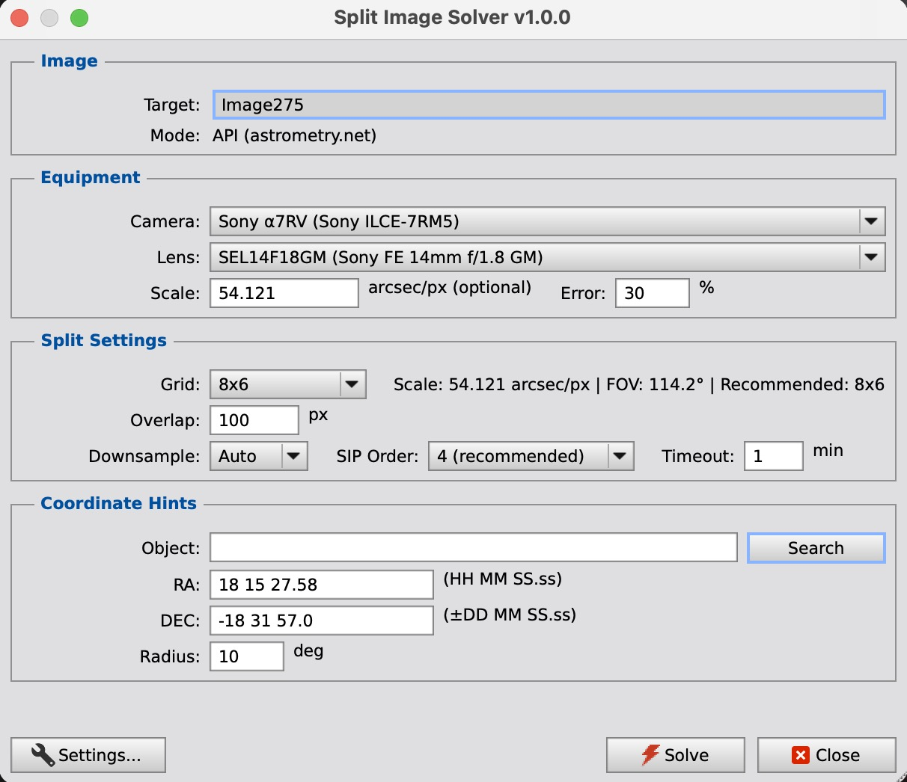
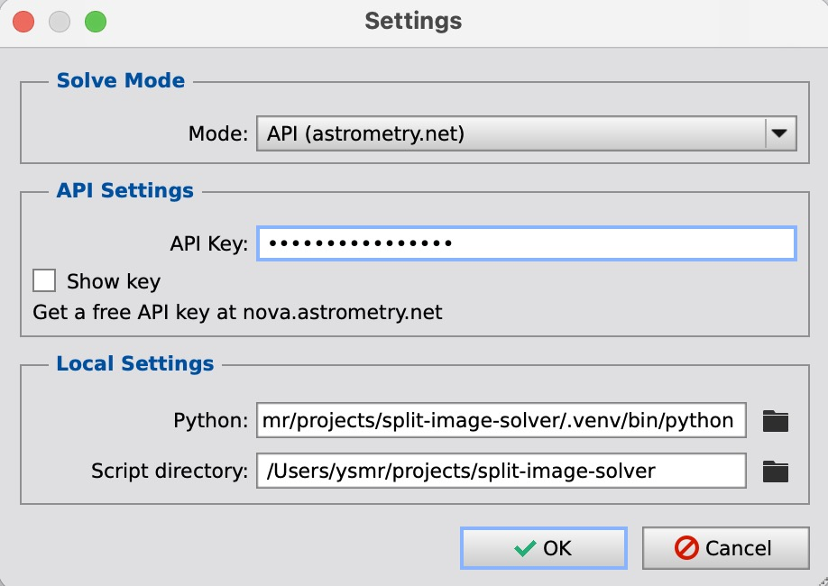

# Split Image Solver

広角星野写真を分割してプレートソルブし、統合したWCS座標情報を元画像に適用する PixInsight スクリプトです。

PixInsight の ImageSolver では対応できない超広角な範囲の星空画像に対応します。

## 特徴

- **2つのソルブモード**: astrometry.net API（デフォルト）またはローカル solve-field を選択可能
- **柔軟な分割**: 1x1（単一画像）から 12x8 まで、任意のグリッドパターンで画像を分割
- **高精度**: SIP 歪み補正対応、WCSFitter による制御点フィット
- **部分ソルブ対応**: 一部のタイルのソルブに失敗しても、成功したタイルから WCS を全体に適用
- **2パスリトライ**: 失敗タイルを隣接成功タイルの WCS ヒントで自動再試行
- **オーバーラップ検証**: 隣接タイルの重複領域で WCS 整合性を自動チェック
- **機材 DB**: カメラ/レンズの自動認識（型番表示対応）、ピクセルスケール自動計算、推奨グリッド提案
- **魚眼レンズ対応**: equisolid/equidistant/stereographic 投影に対応、タイルごとのスケール補正
- **Sesame 天体名検索**: 天体名から RA/DEC を自動入力

## ソルブモード

| モード | 説明 | 必要な環境 |
|--------|------|-----------|
| **API** (デフォルト) | astrometry.net API でソルブ | API キーのみ（Python 不要） |
| **Local** | ローカル solve-field でソルブ | Python + solve-field + 星カタログ |

API モードは追加インストール不要ですぐに利用できます。
Local モードを利用する場合は「[Local モードのセットアップ](#local-モードのセットアップ)」を参照してください。

## 必要な環境

- **PixInsight 1.8.9 以降**
- **astrometry.net API キー**（無料、API モード用）: https://nova.astrometry.net/ でアカウント作成後取得

## インストール

### 方法1: PixInsight リポジトリ（推奨）

1. PixInsight を開く
2. **Resources > Updates > Manage Repositories** を開く
3. リポジトリ URL を追加:
   ```
   https://raw.githubusercontent.com/ysmr3104/split-image-solver/main/repository/
   ```
4. **Resources > Updates > Check for Updates** を実行
5. SplitImageSolver をインストール

### 方法2: 手動インストール

1. リポジトリをクローンまたはダウンロード:
   ```bash
   git clone https://github.com/ysmr3104/split-image-solver.git
   ```

2. `javascript/` 内の以下のファイルを PixInsight スクリプトディレクトリにコピー:
   ```
   SplitImageSolver.js
   astrometry_api.js
   wcs_math.js
   wcs_keywords.js
   equipment_data.jsh
   ```

   スクリプトディレクトリの場所:
   - macOS: `/Applications/PixInsight/src/scripts/SplitImageSolver/`
   - Windows: `C:\Program Files\PixInsight\src\scripts\SplitImageSolver\`
   - Linux: `/opt/PixInsight/src/scripts/SplitImageSolver/`

3. PixInsight を再起動
4. **Script > Astrometry > SplitImageSolver** から実行可能

## スクリーンショット

### メインダイアログ



機材（カメラ・レンズ）を選択するとピクセルスケールと推奨グリッドが自動計算されます。FITS ヘッダーから機材を自動認識し、型番も表示されます。天体名を入力して Search ボタンで RA/DEC を取得できます。

### Settings ダイアログ



左下の「Settings...」ボタンから開きます。ソルブモード（API / Local）の切り替え、API キー、Python 環境の設定を行います。どちらのモードの設定値も常に記憶されます。

## 使い方

### クイックスタート（単一画像ソルブ）

1. PixInsight で対象画像を開く
2. **Script > Astrometry > SplitImageSolver** を実行
3. 左下の **Settings...** ボタンで API キーを入力（初回のみ、以降は自動保存）
4. Grid を **1x1** のまま「Solve」をクリック
5. 完了後、画像に WCS が適用される

### 分割ソルブ（広角画像）

1. PixInsight で対象画像を開く
2. **Script > Astrometry > SplitImageSolver** を実行
3. **カメラ/レンズ** を選択（FITS ヘッダーから自動認識される場合あり）
   - ピクセルスケールと推奨グリッドが自動計算される
4. 必要に応じて **天体名** を入力し「Search」で RA/DEC を取得
5. Grid を推奨サイズに設定
6. 「Solve」をクリック

### パラメータ

| パラメータ | 説明 | デフォルト | モード |
|-----------|------|-----------|--------|
| Camera | カメラ機種（ピクセルピッチ自動入力） | 自動認識 | 共通 |
| Lens | レンズ/鏡筒（焦点距離・投影型自動入力） | 自動認識 | 共通 |
| Scale | ピクセルスケール (arcsec/px) | 自動計算 | 共通 |
| Scale Error | スケール誤差 (%) | 30 | API |
| Object | 天体名（Sesame 検索） | — | 共通 |
| RA / DEC | 画像中心座標 | — | 共通 |
| Radius | 検索半径 (°) | 10 | API |
| Grid | 分割グリッド (ColsxRows) | 1x1 | 共通 |
| Overlap | タイル間オーバーラップ (px) | 100 | 共通 |
| Downsample | ダウンサンプル設定 | Auto | API |
| SIP Order | SIP 歪み補正の次数 | 4 | API |
| Timeout | タイルあたりのタイムアウト (分) | 1 | API |

「API」と記載の項目は Local モード時にグレーアウトされます（Python 側が自動処理）。

## 処理フロー

### API モード — 単一画像（1x1）

1. 画像を FITS に書き出し → API にアップロード
2. astrometry.net でプレートソルブ
3. WCS FITS ファイルをダウンロード → WCS パラメータを解析
4. WCSFitter で CD 行列 + SIP フィット
5. FITS キーワード + 制御点を画像に適用

### API モード — 分割ソルブ（NxM）

1. 画像をオーバーラップ付き NxM タイルに分割
2. 各タイルをダウンサンプル（長辺 2000px 以下）して API にアップロード
3. **Pass 1**: 全タイルをソルブ
4. **Pass 2**: 失敗タイルを成功タイルの WCS ヒントで再試行
5. **オーバーラップ検証**: 隣接タイルの WCS 整合性チェック、異常タイルを除外
6. 全成功タイルの WCS から制御点を収集 → WCSFitter で統合 WCS を生成
7. 統合 WCS を元画像に適用

### Local モード

1. 画像を XISF に一時保存（FITS メタデータ含む）
2. Python `main.py` を実行（グリッド分割・ソルブ・WCS 統合を一括処理）
3. 結果 JSON から WCS キーワードを取得
4. FITS キーワードを画像に直接適用 + アストロメトリックソリューション再生成

## Local モードのセットアップ

Local モードを利用するには、以下の追加セットアップが必要です。

### 1. 必要なソフトウェア

- **Python 3.8 以降**（astropy, scipy, numpy が必要）
- **astrometry.net solve-field** + 星カタログ（数 GB）

### 2. Python 環境の構築

```bash
# リポジトリをクローン
git clone https://github.com/ysmr3104/split-image-solver.git
cd split-image-solver

# Python 仮想環境を作成・有効化
python3 -m venv .venv
source .venv/bin/activate

# 依存パッケージをインストール
pip install astropy scipy numpy
```

### 3. solve-field のインストール

#### macOS (Homebrew)

```bash
brew install astrometry-net
```

#### Linux (Ubuntu/Debian)

```bash
sudo apt install astrometry.net astrometry-data-tycho2
```

星カタログ（index ファイル）のダウンロードも必要です。詳細は [astrometry.net のドキュメント](http://astrometry.net/doc/readme.html) を参照してください。

### 4. PixInsight での設定

1. **Script > Astrometry > SplitImageSolver** を実行
2. 左下の **Settings...** ボタンをクリック
3. **Solve Mode** を「Local (solve-field)」に変更
4. **Local Settings** セクションで以下を設定:
   - **Python**: Python 実行ファイルのパス（例: `/path/to/split-image-solver/.venv/bin/python3`）
     - .venv 内の Python は Finder から見えない場合があるため、直接パスを入力してください
   - **Script directory**: split-image-solver リポジトリのパス（例: `/path/to/split-image-solver`）
5. 「OK」をクリック

設定は永続化されるため、次回以降は自動的に Local モードで起動します。
API モードに戻したい場合は Settings で Mode を切り替えるだけです。

### 注意事項

- Local モード選択時、Downsample / SIP Order / Timeout / Radius はグレーアウトされます（Python 側が自動処理するため）
- Scale / Scale Error は両モードで使用可能です（機材 DB にないカメラ・レンズの場合に手入力できます）
- どちらのモードを選択していても、API キーと Python 環境の設定値はそれぞれ記憶されます

## プロジェクト構造

```
split-image-solver/
├── javascript/
│   ├── SplitImageSolver.js    # メインスクリプト（UI + エンジン）
│   ├── astrometry_api.js      # astrometry.net API クライアント
│   ├── wcs_math.js            # WCS 数学ライブラリ
│   ├── wcs_keywords.js        # FITS キーワードユーティリティ
│   └── equipment_data.jsh     # 機材データベース（カメラ・レンズ）
├── python/                    # Local モード用 Python 実装
├── build-split-release.sh     # リリースビルドスクリプト
├── repository/                # PixInsight リポジトリ配布パッケージ
├── tests/                     # テスト
└── docs/                      # ドキュメント
```

## トラブルシューティング

### API ログインに失敗

- API キーが正しいか確認: https://nova.astrometry.net/api_help
- インターネット接続を確認

### ソルブに時間がかかる / 失敗する

- **RA/DEC ヒントを入力**: 天体名を入力して Search ボタンで座標を取得すると、ソルブ速度が大幅に向上
- **ピクセルスケールを入力**: カメラ/レンズを選択するか、手動で入力
- **グリッドを調整**: タイルが小さすぎると星が少なくてソルブ失敗しやすい

### 一部タイルがソルブできない

- 地上風景や雲を含むタイルはソルブできません（正常動作）
- 2タイル以上成功すれば WCS 統合が可能です
- Pass 2 リトライで自動的に再試行されます

### WCS 精度が低い

- オーバーラップを増やす（100 → 200px）
- SIP Order を上げる（2 → 4）
- グリッドを細かくする

### Local モードで Python が見つからない

- Settings の Python パスが正しいか確認
- .venv を使用している場合、`/path/to/.venv/bin/python3` を直接入力
- solve-field がインストールされ、PATH に含まれているか確認

## ライセンス

MIT License

## 参考資料

- [Astrometry.net](https://astrometry.net/) — プレートソルバー
- [Astrometry.net API](https://nova.astrometry.net/api_help) — API ドキュメント
- [PixInsight](https://pixinsight.com/) — 天体画像処理ソフトウェア
- [FITS WCS Standard](https://fits.gsfc.nasa.gov/fits_wcs.html) — FITS WCS 規格
