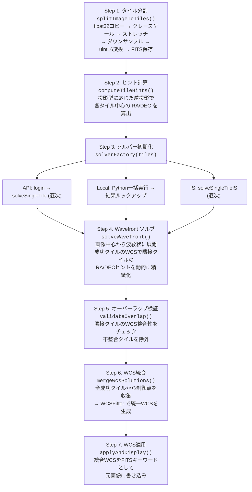
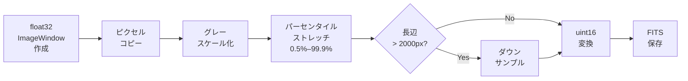
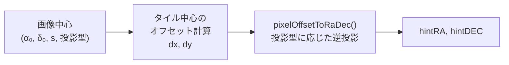
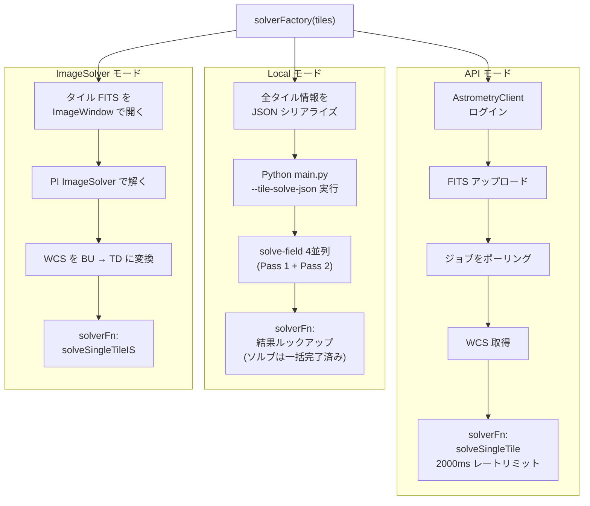
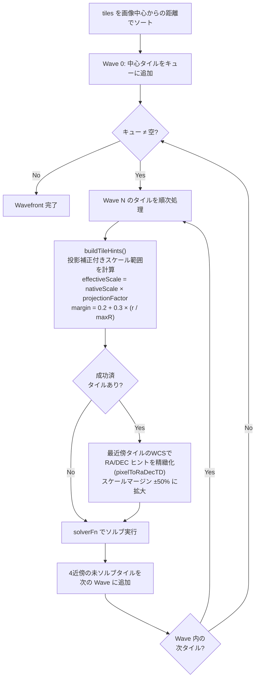
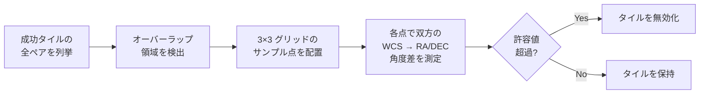
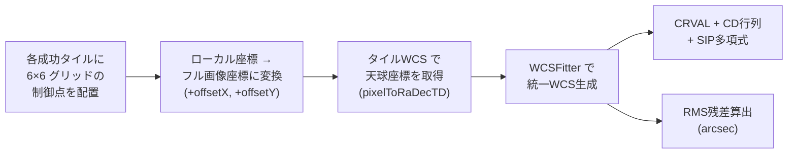
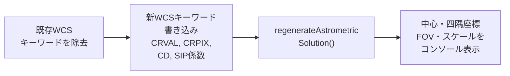
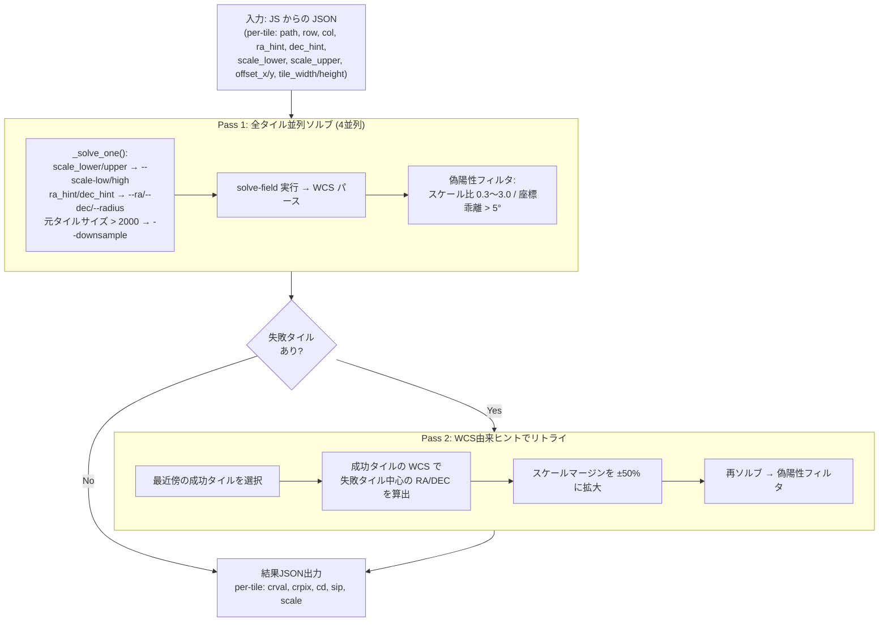
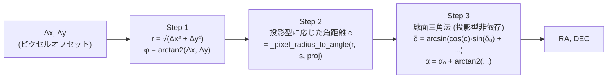

# Split Image Solver — 技術仕様書

## 1. プロジェクト概要

Split Image Solver は、広角〜超広角の星野写真をタイルに分割してプレートソルブし、個別の WCS 解を統合して元画像全体の WCS を生成する PixInsight スクリプトです。

3つのソルブモードに対応:
- **API モード**: astrometry.net API（デフォルト）
- **Local モード**: ローカル solve-field（Python 経由）
- **ImageSolver モード**: PixInsight 内蔵 ImageSolver

PixInsight の ImageSolver では対応できない広角画像（FOV > 60°）を主な対象としており、フルサイズセンサー + 14mm レンズ（対角 FOV ~147°）のような超広角構成でも動作します。

### 1.1 解決する課題

| 課題 | 原因 | 本ツールのアプローチ |
|------|------|---------------------|
| ImageSolver が広角で失敗する | TAN投影の1枚ソルブではFOV > 60°に対応困難 | 画像をタイル分割し、各タイルを個別にソルブ |
| 広角画像のピクセルスケールが一様でない | gnomonic投影の非線形性 | タイルごとに実効ピクセルスケールを計算 |
| レンズ歪曲収差が星のパターンマッチを妨げる | 樽型歪曲がカタログのquadパターンと不一致 | SIP歪み多項式による補正 |
| 端タイルがソルブ失敗しやすい | スケールヒント不正確、星密度低下 | Wavefront ソルブ（成功タイルのWCSからヒントを動的に精緻化） |
| 星景写真の地上部分でソルブが無駄に実行される | 地上景に星がない | エッジスキップ機能でソルブ対象から除外 |

### 1.2 対応フォーマット

- **入力**: FITS (.fits, .fit), XISF (.xisf)
- **出力**: FITS (.fits, .fit), XISF (.xisf)
- **WCS標準**: TAN投影 + SIP歪み多項式（FITS WCS Paper II準拠）

---

## 2. 処理フロー概要

全モード共通の統一パイプライン（`doSplitSolveCore()`）で処理されます。モード間の違いは「各タイルをどのソルバーで解くか」のみです。



---

## 3. 処理フロー詳細

### 3.1 Step 1: タイル分割 — `splitImageToTiles()`

元画像を NxM のグリッドに分割し、各タイルを前処理してFITS保存します。

**分割パラメータ:**

| パラメータ | 説明 | デフォルト |
|-----------|------|-----------|
| `gridX × gridY` | グリッドパターン（例: 3x3, 8x6） | 3x3 |
| `overlap` | タイル間のオーバーラップ (px) | 100 |
| `skipEdges` | エッジスキップ（上,下,左,右のタイル行/列数） | なし |

**タイルごとの前処理パイプライン:**



**出力タイルメタデータ:**

各タイルオブジェクトに以下が付与されます:
- `offsetX`, `offsetY` — 元画像内のピクセルオフセット
- `tileWidth`, `tileHeight` — タイルサイズ
- `scaleFactor` — ダウンサンプル率 (1.0 = 未ダウンサンプル)
- `filePath` — 一時FITS保存先パス

### 3.2 Step 2: ヒント計算 — `computeTileHints()`

画像中心の天球座標が既知の場合、投影型に応じた逆投影で各タイル中心のRA/DECを算出します。



投影型のサポート: gnomonic (rectilinear), equisolid, equidistant, stereographic

### 3.3 Step 3: ソルバー初期化 — `solverFactory()`

`solverFactory(tiles)` はモード固有のセットアップを行い、`solverFn` を返します。



### 3.4 Step 4: Wavefront ソルブ — `solveWavefront()`

画像中心から波紋状にタイルを展開するアルゴリズムです。従来の「Pass 1 全タイル → Pass 2 失敗リトライ」方式に代わり、成功タイルのWCSを即座に活用して隣接タイルのヒントを精緻化します。

**アルゴリズム:**



**偽陽性フィルタ** (API / ImageSolver モード):

各タイルのソルブ結果に対して:
- **スケール整合性**: `result_scale / medianScale` が 0.3〜3.0 の範囲外なら棄却
- **座標整合性**: 期待座標からの乖離が 5° 超なら棄却

### 3.5 Step 5: オーバーラップ検証 — `validateOverlap()`

隣接する成功タイルペアのオーバーラップ領域で、双方のWCSから天球座標を算出し整合性を検証します。



許容値: `max(5.0, scaleEst × 3)` arcsec

### 3.6 Step 6: WCS統合 — `mergeWcsSolutions()`

全成功タイルから制御点を収集し、`WCSFitter` で統一WCSを生成します。



### 3.7 Step 7: WCS適用 — `applyAndDisplay()`



---

## 4. Local モード: Python 側の処理フロー

Local モードでは、JS がタイル分割とヒント計算を行った後、Python がタイルごとの solve-field 実行を担当します。

### 4.1 tile_solve_mode — `run_tile_solve_mode()`



### 4.2 solve-field コマンド構成

```bash
solve-field --overwrite --no-plots --no-remove-lines --no-verify-uniformize \
  --crpix-center --tweak-order 4 \
  --scale-low <scale_lower> --scale-high <scale_upper> --scale-units arcsecperpix \
  --ra <ra_hint> --dec <dec_hint> --radius <search_radius> \
  [--downsample N] \
  --cpulimit <timeout> input.fits
```

| フラグ | 目的 |
|--------|------|
| `--crpix-center` | 歪みの基準点を画像中心に固定 |
| `--tweak-order 4` | SIP多項式次数 |
| `--no-verify-uniformize` | ソース点均一化チェックをスキップ（高速化） |
| `--scale-units arcsecperpix` | scale_lower/scale_upper を arcsec/px で直接指定 |

**スケール範囲の渡し方:**

`scale_lower`/`scale_upper` は JS の `buildTileHints()` で投影補正付きで計算済みの値であり、Python は FOV への逆変換なしで `--scale-low`/`--scale-high` にそのまま渡します。

### 4.3 CRPIX 逆変換 (JS 側)

Python から返された WCS を元画像座標系に変換する処理は JS 側で行います:

```javascript
// ダウンサンプル逆変換 + タイルオフセット適用 (トップダウン convention)
tile.wcs.crpix1 = (r.crpix1 / scaleFactor) + tile.offsetX;
tile.wcs.crpix2 = (r.crpix2 / scaleFactor) + tile.offsetY;
tile.wcs.cd1_1  = r.cd1_1 * scaleFactor;
tile.wcs.cd1_2  = r.cd1_2 * scaleFactor;
tile.wcs.cd2_1  = r.cd2_1 * scaleFactor;
tile.wcs.cd2_2  = r.cd2_2 * scaleFactor;
```

---

## 5. 投影型対応とスケール補正

### 5.1 サポートする投影型

| 投影型 | レンズ種別 | r(θ) の式 | スケール倍率 dθ/dr |
|--------|-----------|-----------|-------------------|
| gnomonic | rectilinear（通常レンズ） | r = tan(θ)/s | 1/cos²(θ) |
| equisolid | 対角魚眼（大半の魚眼レンズ） | r = 2·sin(θ/2)/s | 1/cos(θ/2) |
| equidistant | 円周魚眼 | r = θ/s | 1（一定） |
| stereographic | 一部の魚眼 | r = 2·tan(θ/2)/s | 1/cos²(θ/2) |

### 5.2 タイルごとの実効ピクセルスケール計算

JS (`buildTileHints`) と Python (`calculate_tile_pixel_scale`) の双方に同一ロジックが実装されています。

```
r = √((tile_x - center_x)² + (tile_y - center_y)²)   [pixels]

Step 1: 投影型に応じた角距離θを計算
  gnomonic:       θ = arctan(r × s)
  equisolid:      θ = 2 × arcsin(r × s / 2)
  equidistant:    θ = r × s
  stereographic:  θ = 2 × arctan(r × s / 2)

Step 2: スケール倍率を計算
  gnomonic:       factor = 1 / cos²(θ)
  equisolid:      factor = 1 / cos(θ/2)
  equidistant:    factor = 1
  stereographic:  factor = 1 / cos²(θ/2)

Step 3: 実効スケール
  scale_effective = scale_center × factor   [arcsec/pixel]
```

### 5.3 動的マージン計算

画像端に近いタイルほどスケールの不確実性が大きいためマージンを広げます。

```
r_ratio = distance_from_center / max_distance  (0.0〜1.0)
margin = 0.2 + 0.3 × r_ratio  (中心: ±20%, コーナー: ±50%)
```

Wavefront の Wave 2 以降（WCS外挿ヒント使用時）はマージンを ±50% に拡大。

### 5.4 RA/DEC ヒント計算

`pixelOffsetToRaDec()` (JS/Python 共通ロジック):



---

## 6. WCS統合 — `WCSFitter`

### 6.1 制御点の収集

各成功タイルに 6×6 グリッドの制御点を配置し、タイル WCS で天球座標を算出。CRPIXは元画像座標系にオフセット済みのため、制御点のピクセル座標もフル画像座標系で記録されます。

### 6.2 統一WCS生成

`WCSFitter` (wcs_math.js) が以下を最適化:

1. **CRVAL**: 制御点の重心から算出
2. **CD 行列**: 4パラメータの最小二乗フィッティング
3. **SIP 歪み多項式**: TAN投影残差を高次多項式で補正

### 6.3 座標 Convention

| 場面 | Convention |
|------|-----------|
| タイル FITS (astrometry.net, solve-field) | トップダウン (y=1 が画像上端) |
| CRPIX オフセット適用 | トップダウン (crpix1 += offsetX, crpix2 += offsetY) |
| WCSFitter 出力 | ボトムアップ (FITS 標準) |
| PixInsight 表示 | ボトムアップ |

---

## 7. モード間の差異

| 項目 | API | Local | ImageSolver |
|------|-----|-------|-------------|
| タイル分割 | JS (共通) | JS (共通) | JS (共通) |
| ヒント計算 | JS (共通) | JS (共通) | JS (共通) |
| ソルブ実行 | JS: astrometry.net API | Python: solve-field (4並列) | JS: PI ImageSolver |
| レートリミット | 2000ms | なし | なし |
| Wavefront | JS (逐次) | JS (結果ルックアップ) | JS (逐次) |
| WCS統合 | JS WCSFitter (共通) | JS WCSFitter (共通) | JS WCSFitter (共通) |
| Python 必要 | 不要 | 必要 | 不要 |
| Split対応 | NxM | NxM | NxM |
| 1x1対応 | あり | あり | あり |

**Local モードの特殊性:**

Local モードでは `solverFactory` が Python を一括実行し、全タイルの結果をメモリに保持します。その後の `solveWavefront()` では実際のソルブは行わず、結果の参照のみを行います。ただし Wavefront のヒント精緻化やスケールマージン拡大は JS 側で計算され、Python の `run_tile_solve_mode()` の Pass 2 でも同等のリトライが行われるため、二重にリトライが実施されます。

---

## 8. PixInsight GUI 連携

### 8.1 パラメータ渡し方式

GUI は `--focal-length` と `--pixel-pitch` を直接 Python に渡します。

```javascript
args.push("--focal-length", params.focalLength.toString());
args.push("--pixel-pitch", params.pixelPitch.toString());
```

### 8.2 結果ファイル方式

Python の JSON 出力は一時ファイル経由で受け渡します。PJSR の `ExternalProcess` での stdout キャプチャはライブラリ出力の混入やバッファリング問題があるため。

### 8.3 PJSR JSON 互換性

PJSR の `JSON.parse()` には以下の制約があり、Python 側で対策:

- **科学表記法の非対応**: `1.23e-06` → `0.00000123` に変換
- **過剰な小数桁数の非対応**: 全浮動小数点数を12有効桁・最大15桁小数に丸め

### 8.4 WCS キーワードの直接適用

ソルブ結果の WCS キーワードは、PixInsight のウィンドウに直接書き込みます。ファイル再読み込みが不要になり、STF・ウィンドウ位置・ズーム状態が保持されます。

### 8.5 タイル出力ディレクトリ

設定ダイアログで有効化すると、タイル分割後のFITSファイルをユーザー指定ディレクトリにコピーします。テストフィクスチャの作成やデバッグに使用。

---

## 9. テスト構成

### 9.1 テストの種類

| テスト | コマンド | 対象 |
|--------|---------|------|
| JS 単体テスト | `node tests/javascript/test_split_solver.js` | WCS数学、座標変換等の純粋関数 |
| JS API パイプライン | `node tests/javascript/test_pipeline_api.js` | API モード E2E |
| JS Local パイプライン | `node tests/javascript/test_pipeline_local.js` | Local モード E2E |
| Python 単体テスト | `PYTHONPATH="." .venv/bin/pytest tests/python -v` | 座標変換、ソルバー等 |
| Python Local リグレッション | `PYTHONPATH="." .venv/bin/pytest tests/python/test_local_tile_regression.py -v -s` | solve-field 実行のリグレッション |

### 9.2 テストフィクスチャ

| ディレクトリ | 内容 |
|-------------|------|
| `tests/fits_original/` | JS float32 前処理済みタイル FITS (テスト基準) |
| `tests/fits_downsampling/` | ダウンサンプル済みタイル FITS |
| `tests/fits_old_api/` | 旧 API 用タイル FITS |
| `tests/fits_old_python/` | 旧 Python 用タイル FITS |
| `tests/javascript/fixtures/` | タイル WCS・ヒントの JSON フィクスチャ |

### 9.3 リグレッションテストのベースライン

| ケース | グリッド | ベースライン | しきい値 |
|--------|---------|-------------|---------|
| 2x2 | 2×2 (4タイル) | 4/4 | ≥ 3/4 |
| 8x6 | 8×6 (48タイル) | 8/48 | ≥ 8/48 |

---

## 10. ファイル構成

```
split-image-solver/
├── javascript/
│   ├── SplitImageSolver.js        # メインスクリプト (UI + 統一パイプライン)
│   │   ├── splitImageToTiles()     # タイル分割・前処理
│   │   ├── computeTileHints()      # 投影型対応ヒント計算
│   │   ├── solveWavefront()        # Wavefront ソルブアルゴリズム
│   │   ├── mergeWcsSolutions()     # WCS統合
│   │   ├── validateOverlap()       # オーバーラップ検証
│   │   ├── doSplitSolveCore()      # 統一パイプライン
│   │   ├── doSplitSolve()          # API モード エントリ
│   │   ├── doSplitSolveIS()        # ImageSolver モード エントリ
│   │   └── doLocalSolve()          # Local モード エントリ
│   ├── astrometry_api.js           # astrometry.net API クライアント
│   ├── wcs_math.js                 # WCS 数学ライブラリ (WCSFitter 含む)
│   ├── wcs_keywords.js             # FITS キーワードユーティリティ
│   ├── equipment_data.jsh          # 機材DB (カメラ + レンズ)
│   └── imagesolver_bridge.jsh      # PI ImageSolver ブリッジ
├── python/
│   ├── main.py                     # CLI エントリーポイント, tile_solve_mode
│   ├── solvers/
│   │   └── astrometry_local_solver.py  # solve-field ラッパー
│   └── utils/
│       └── coordinate_transform.py # 投影型対応の座標変換
├── config/
│   ├── equipment.yaml              # 機材データベース
│   └── settings.json               # 実行時設定 (gitignore対象)
├── tests/
│   ├── javascript/                 # JS テスト + フィクスチャ
│   └── python/                     # Python テスト
└── docs/
    ├── specs.md                    # 本仕様書
    └── architecture.md             # アーキテクチャ概要
```

---

## 11. 外部依存

### 必須

| パッケージ | 用途 |
|-----------|------|
| PixInsight 1.8.9+ | PJSR スクリプト実行環境 |
| astrometry.net API キー | API モード用 (無料) |
| curl | HTTP 通信 (OS 標準搭載, API モード用) |

### Local モード追加依存

| パッケージ | 用途 |
|-----------|------|
| Python 3.8+ | Local モードバックエンド |
| solve-field | プレートソルブエンジン |
| astropy | WCS操作、FITS I/O |
| numpy | 配列演算 |
| scipy | 最小二乗最適化 |

---

## 12. 既知の制限

1. **地上景タイル**: 星が写っていない領域はソルブ不可能
2. **極端な歪みのエッジタイル**: FOV > 120° のコーナータイルは成功率が低い
3. **インデックスファイル依存**: 大スケールクワッド用インデックスが不足するとエッジタイルが失敗
4. **Local モードの二重リトライ**: Python Pass 2 と JS Wavefront で重複するリトライが発生する（Local モード固有）
